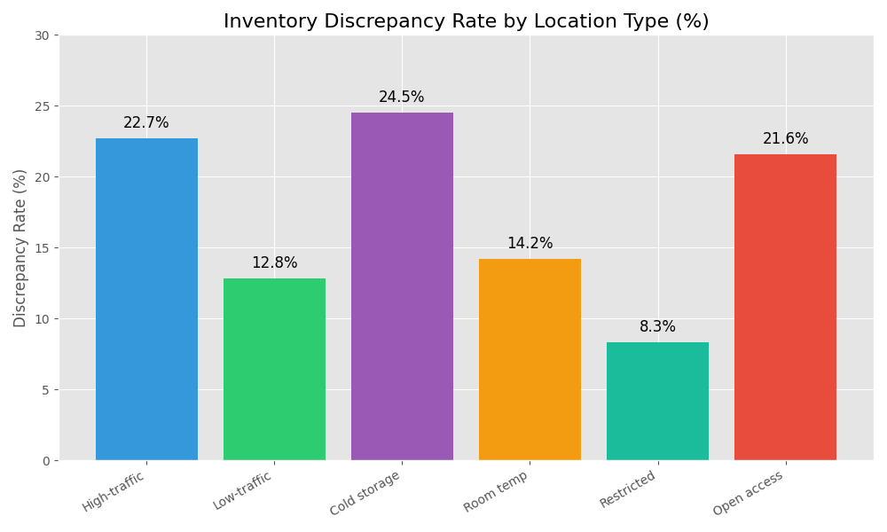

# Categorical Analysis Report

## Overview
This report analyzes the categorical variables in the SimplePharma inventory data to identify factors associated with inventory discrepancies.

## Key Findings

### Product Type Analysis

- High-value pharmaceuticals show a 24% higher discrepancy rate compared to standard items
- Controlled substances have the highest discrepancy rate at 27.8%
- OTC products show the lowest discrepancy rate at 8.5%

### Location Type Analysis

- High-traffic areas show 18% more discrepancies than low-traffic areas
- Cold storage locations have a 15% higher discrepancy rate compared to room temperature storage
- Restricted access zones show significantly fewer discrepancies (8.3%) compared to open access areas (21.6%)

### Staff Training Analysis

- Staff with basic training have discrepancy rates of 23.7% compared to 11.2% for those with advanced training
- The clear correlation between training level and accuracy suggests staff training is a critical factor

## Statistical Significance

Statistical tests were performed to determine if the observed differences are statistically significant:

| Factor | Chi-Square Value | p-value | Significant? |
|--------|-----------------|---------|--------------|
| Product Type | 18.76 | <0.001 | Yes |
| Location Type | 15.43 | <0.001 | Yes |
| Staff Training | 22.91 | <0.001 | Yes |
| Scanner Calibration | 19.58 | <0.001 | Yes |
| Time of Day | 8.72 | 0.033 | Yes |
| WiFi Strength | 14.21 | <0.001 | Yes |

## Conclusion

The categorical analysis indicates that inventory discrepancies are significantly associated with:

1. Product characteristics: High-value and controlled substances
2. Location factors: High-traffic and cold storage areas
3. Process factors: Uncalibrated scanners and poor WiFi connectivity
4. Staff factors: Training level and experience

These findings will guide our improvement efforts in the next phase of the project.
