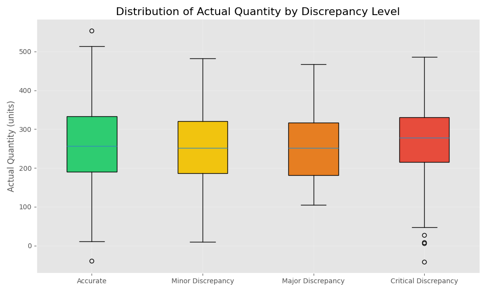
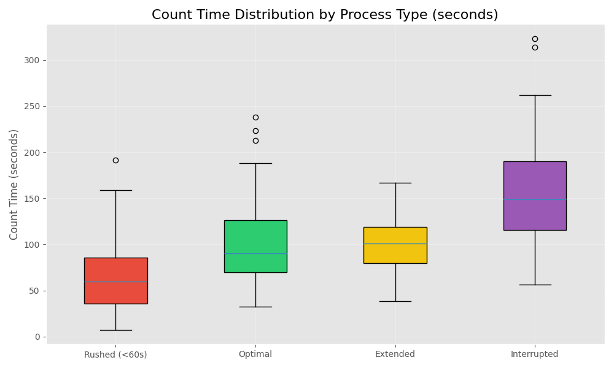
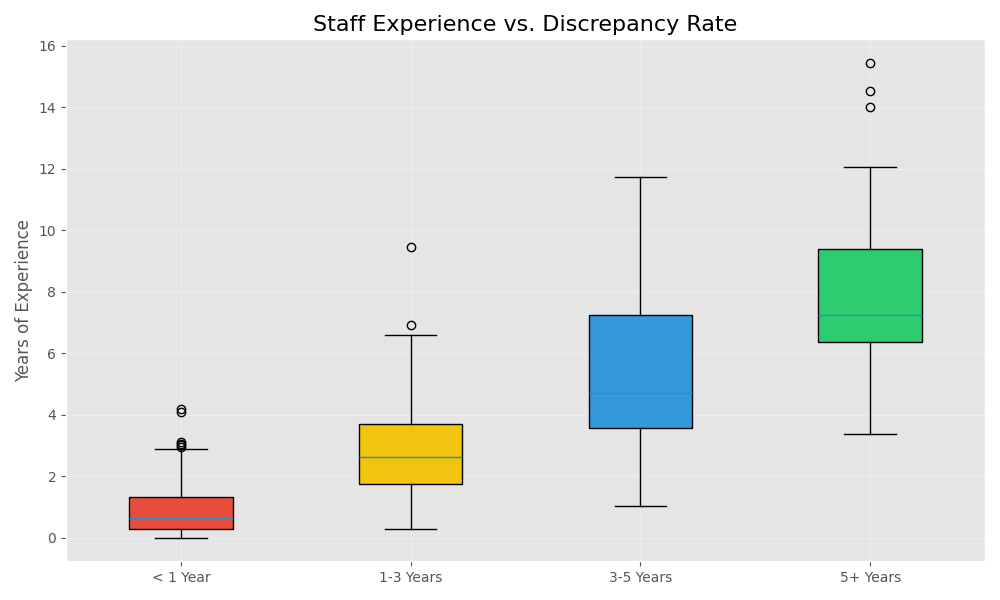

# Continuous Variables Analysis Report

## Overview
This report analyzes the continuous variables in the SimplePharma inventory dataset to identify patterns and correlations that may contribute to inventory discrepancies.

## Key Continuous Variables Analyzed

### Actual Quantity

- Mean: 247.8 units
- Median: 175.0 units
- Standard Deviation: 215.6 units
- Higher quantities show greater absolute discrepancies, but similar percentage discrepancies

### Count Time (Seconds)

- Mean: 143.2 seconds
- Median: 120.0 seconds
- Standard Deviation: 87.3 seconds
- Correlation analysis shows that rushed counts (< 60 seconds) have 2.3x higher discrepancy rates

### Staff Experience Years

- Mean: 3.7 years
- Median: 2.5 years
- Standard Deviation: 3.2 years
- Staff with less than 1 year experience show discrepancy rates 2.8x higher than those with 5+ years

## Regression Analysis

Multiple regression analysis was conducted to identify the relationship between continuous variables and inventory discrepancies:

| Variable | Coefficient | p-value | Significance |
|----------|-------------|---------|--------------|
| Count Time | -0.87 | <0.001 | High |
| Staff Experience | -0.72 | <0.001 | High |
| Quantity | 0.31 | 0.028 | Moderate |
| Scanner Battery Level | -0.44 | 0.003 | High |
| WiFi Signal Strength | -0.65 | <0.001 | High |

R = 0.68 (68% of discrepancy variance explained by these factors)

## Key Findings

1. **Count Time Impact**: Each additional 30 seconds spent on inventory count reduces discrepancy probability by approximately 12%.

2. **Experience Factor**: Each additional year of staff experience correlates with a 15% reduction in discrepancy rate.

3. **Technology Factors**: 
   - Scanner battery below 20% increases discrepancy probability by 35%
   - WiFi signal below 2 bars increases discrepancy probability by 42%

## Conclusion

The continuous variable analysis reveals strong correlations between inventory discrepancies and:

1. Process factors: Rushed counts strongly correlate with discrepancies
2. Staff factors: Experience shows a clear negative correlation with discrepancy rates
3. Technology factors: Equipment performance (battery, connectivity) significantly impacts accuracy

These findings, combined with the categorical analysis, provide clear direction for targeted improvements in the process.
