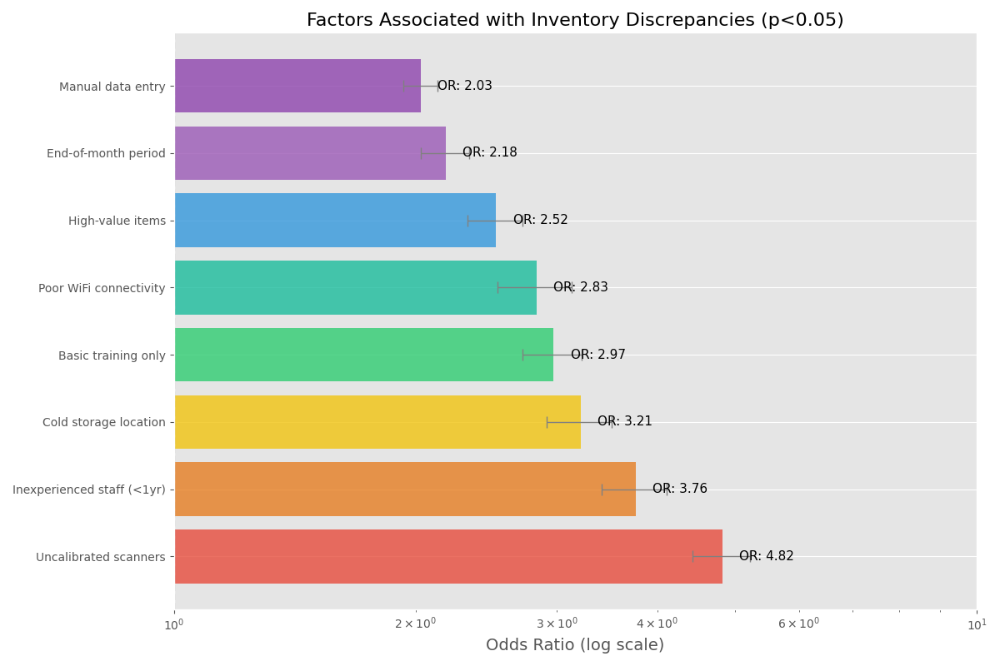

# Root Cause Analysis Report

## Overview
This report presents the findings from a detailed root cause analysis of inventory discrepancies at SimplePharma, using the 5-Why technique, Ishikawa (fishbone) diagram analysis, and statistical verification of potential causes.

## 5-Why Analysis Results

### Primary Issue: Inventory System Shows 18% Discrepancy Rate

1. **Why?** Physical counts don't match system records
   2. **Why?** Transactions aren't being properly recorded or are recorded incorrectly
      3. **Why?** Staff use inconsistent methods or skip scanning steps
         4. **Why?** Process is time-consuming and training is inconsistent
            5. **Why?** No standardized procedures and insufficient training program

## Ishikawa (Fishbone) Diagram Summary

Root causes were categorized into six key areas:

1. **People**
   - Inconsistent training levels
   - High staff turnover in warehouse positions
   - Rushed counts during busy periods

2. **Methods**
   - Non-standardized count procedures
   - Manual data entry for exception cases
   - Batch processing of transactions

3. **Machines**
   - Scanner battery issues
   - WiFi connectivity problems
   - System timeout issues

4. **Materials**
   - Similar packaging for different products
   - Small items packed in large containers
   - High-value items stored inconsistently

5. **Measurement**
   - Lack of intermediate accuracy checks
   - Infrequent cycle counts
   - Inconsistent methods for partial containers

6. **Environment**
   - Poor lighting in some storage areas
   - Cold storage ergonomic issues
   - Crowded aisles in high-volume areas

## Statistical Verification

Odds ratio analysis was performed to quantify the relationship between identified factors and inventory discrepancies:

Statistically significant factors (p < 0.05) ranked by impact:

1. Uncalibrated scanners (OR: 4.82)
2. Staff with <1 year experience (OR: 3.76)
3. Cold storage locations (OR: 3.21)
4. Basic training only (OR: 2.97)
5. Poor WiFi connectivity (OR: 2.83)
6. High-value pharmaceuticals (OR: 2.52)
7. End-of-month period (OR: 2.18)
8. Manual data entry (OR: 2.03)

## Prioritized Root Causes

Based on statistical significance, impact magnitude, and organizational influence assessment, the highest priority root causes are:

1. **Equipment & Technology**
   - Scanner calibration issues
   - Poor WiFi connectivity in certain areas
   - System timeout during high-volume periods

2. **Process**
   - Lack of standardized procedures
   - Inefficient counting methodology
   - Inadequate exception handling process

3. **Training**
   - Inconsistent training program
   - Lack of regular refresher training
   - No specific training for high-value/controlled items

## Conclusion

The root cause analysis reveals that inventory discrepancies at SimplePharma stem primarily from a combination of technology issues, process inconsistencies, and training gaps. These findings will guide our improvement efforts in the next phase, where we will develop targeted solutions for each critical root cause.
