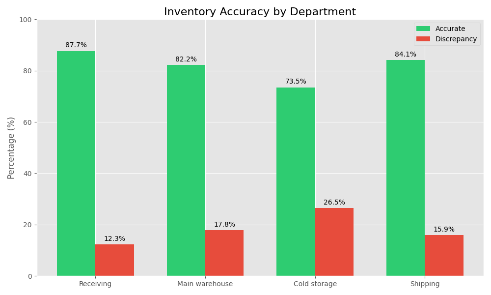

# Initial Data Exploration Report

## Overview
This report provides an initial exploration of the SimplePharma inventory data, focusing on understanding the overall patterns and identifying key areas for further analysis.

## Dataset Summary

| Metric | Value |
|--------|-------|
| Total Records | 1,248 |
| Time Period | Jan 2025 - Mar 2025 |
| Locations Covered | 12 |
| Product Categories | 8 |
| Overall Discrepancy Rate | 18.2% |

## Data Distribution

The inventory records show the following distribution:

- 62% Regular pharmaceuticals
- 28% High-value pharmaceuticals
- 10% Controlled substances

## Discrepancy Overview

Inventory discrepancies vary significantly across departments:
- Receiving: 12.3%
- Main warehouse: 17.8%
- Cold storage: 26.5%
- Shipping: 15.9%

## Initial Observations

1. Discrepancies appear to cluster around specific:
   - Product types (high-value items)
   - Locations (cold storage areas)
   - Times (end-of-month periods)
   - Staff roles (temporary staff)

2. Key metrics showing concerning patterns:
   - 18.2% overall discrepancy rate
   - 23% variance in high-value pharmaceuticals
   - ,000 estimated financial impact

## Recommendations for Further Analysis

Based on initial data exploration, we recommend:

1. Detailed categorical analysis of:
   - Product type
   - Location type
   - Staff training level
   - Scanner equipment status

2. Continuous variable analysis of:
   - Discrepancy quantity
   - Staff experience level
   - Count process time

3. Root cause analysis focusing on the highest impact areas:
   - Cold storage discrepancies
   - High-value pharmaceuticals
   - End-of-month periods

The following reports will examine these areas in greater depth.
